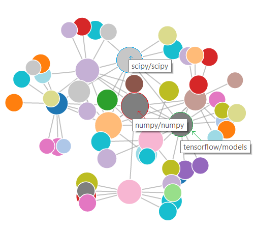
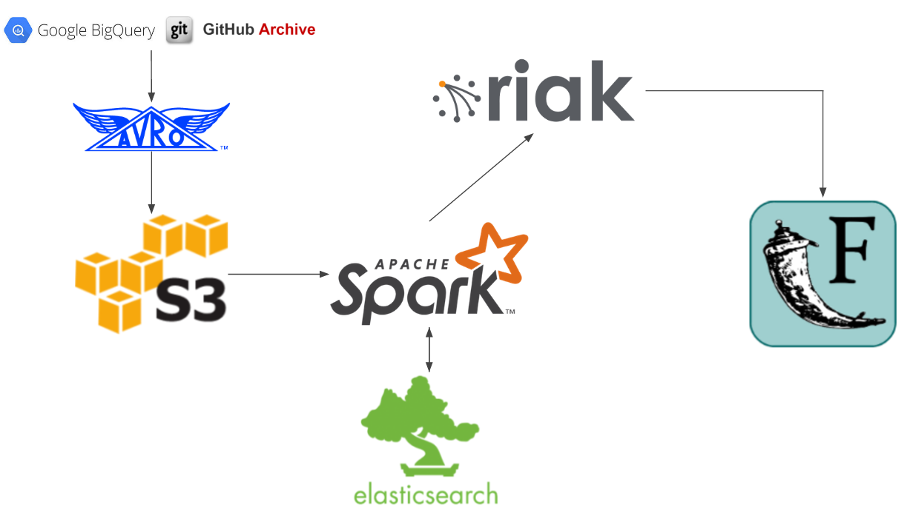
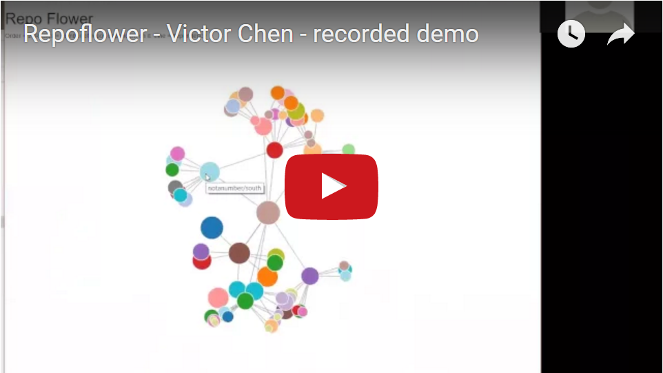

Repoflower
==========

_See how GitHub Repos depend on one another_

[repoflower.top](http://repoflower.top)



Repoflower was my project for [Insight Data Engineering](http://insightdataengineering.com/), Fall 2016 Session C.

## Intro

How many repositories depend on my own repository? **Repoflower** can answer that! It is a data pipeline that analyzes (Python & Go) source files found on GitHub repositories (repos) to then discover how individual repos import/depend on other repos. It makes use of the following technologies:

* Google BigQuery (for obtaining raw GitHub source files)
* Avro
* AWS S3
* Apache Spark 1.6.1
* Redis 3.2.4
* Elasticsearch 2.3.3
* Riak 2.7.0
* Flask 0.11.1
* D3.js 4.2.6

The pipeline is generic enough to extend to other programming languages such as Javascript and Rust.

## Data


[GitHub Archive](https://www.githubarchive.org/) is a public dataset stored on [Google BigQuery](bigquery.cloud.google.com) which contains GitHub API "events" (such as opening a new ticket, commenting, committing) as well as unique file contents of text files under 1MiB on the HEAD branch of its respective repository. The BigQuery table containing the file content holds 197,181,987 source files, overall spanning 1.65TB.

The dataset resides on 5 main tables, of which I used 3 to filter only repository information, file meta-data, and content (source file) tables. I also filtered down to just the Python and Go languages. Francesc Campoy from the Google Cloud team has an excellent [tutorial](https://medium.com/google-cloud/analyzing-go-code-with-bigquery-485c70c3b451#.ge5eov6l5) on how to extract Go files from the BigQuery table. His guide can apply to any other programming language.

For reference, here are the schema of the tables I've used:

**contents**

| id  | size | content | binary | copies |
| --- | ---- | ------- | ------ | ------ |

**files**

| repo_name | ref | path | mode | id  | symlink_target |
| --------- | --- | ---- | ---- | --- | -------------- |

**repos**

| user | repo_name | num_bytes |
| ---- | --------- | --------- |

The data is then transferred from BigQuery into Google Cloud storage buckets via the [Avro](https://avro.apache.org/) serialization format. From there, the data is transferred again into S3 because we, the Insight Data Engineering Fellows, were are the AWS infrastructure.

Finally, the Avro files are streamed into Spark for batch processing. Serialization was primarily used for reducing network traffic of data transfer.

## Pipeline



Since the data is divided across 3 tables, work must be done in joining and aggregating them. The content and file data resided on Spark, while Elasticsearch served as a look-up-table for the GitHub repository names. Spark extracts the dependency information from the import statements of the Python/Go source files via Regex. It ignores dependencies that:

1. refer to a module/package within the same repository
2. are built-in modules (e.g. `system` or `os` for Python, `math` or `fmt` for Go)
3. refer to non GitHub public repos

Spark takes care of step 1 through aggregation, while steps 2 and 3 are handled by Spark querying Elasticsearch for dependency-to-repository matching. In other words, Spark queries Elasticesearch to find the GitHub repository associated with the dependency found in each source file.

This information is aggregated/shuffled to build a graph in adjacency-list format, which is ultimately stored on Riak. Flask/D3.js will pull from Riak to visualize repo-to-repo connections. Since each repo can potentially have tens of thousands of repos that are dependent on it (e.g. `numpy/numpy`), for visualization purposes, I limit the max distance from the queried repo to 2 and node [degree](https://en.wikipedia.org/wiki/Degree_(graph_theory)) to 8. These parameters can be changed to ones liking.

## Video

[](https://youtu.be/O7CMFPxRA70)

## Instructions

Have Redis, Elasticsearch, Riak, and Spark running in the background.

_Note: Redis is also used for accessing common configuration parameters from any server in the cluster. Make sure to restrict Redis access to only within the private network._

Make sure to have the following Python dependencies installed:

```bash
# Elasticsearch
sudo pip install elasticsearch
# Redis
sudo pip install redis
# Riak
sudo apt-get install python-dev libffi-dev libssl-dev
sudo pip install riak

```

Then perform the following commands on the respective instances:

```bash
# Assuming you are in the root directory of the Repoflower project...

# Copy shared_config.py.template into shared_config.py
cp redis/shared_config.py.template \
	redis/shared_config.py

# Assuming you have filled out shared_config.py with the relevant parameters...
python redis/shared_config.py

# Reset & index Elasticsearch with repo names
python elasticsearch/reset_es.py
python elasticsearch/index_es.py python python_repos.csv
python elasticsearch/index_es.py go go_repos.csv

# Clear up Riak (optional)
python riak/reset_riak.py

# Run the Spark batch job
spark-submit --driver-memory 13g --executor-memory 13g \
	--packages com.databricks:spark-avro_2.10:2.0.1 \
	spark/python_batch.py

spark-submit --driver-memory 13g --executor-memory 13g \
	--packages com.databricks:spark-avro_2.10:2.0.1 \
	spark/go_batch.py

# After the batch job is done, tell Flask to be aware of the new data
python flask/refresh.py

# Run the Flask webserver, if you haven't already
sudo python flask/app.py

# Navigate to http://repoflower.top and see the results
```